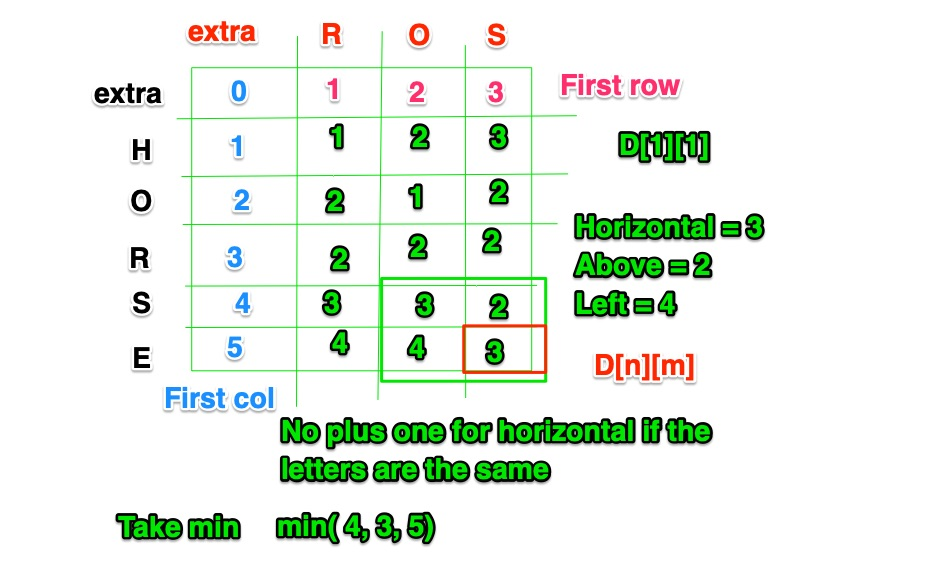

# Dynamic Programming

1. [Dynamic Programming in Python](#dynamic-programming-in-python)
2. [Basic Dynamic Programming Patterns](#basic-dyamic-programming-patterns)
    - [Caching Your Value](#caching-your-value)
    - [Figure Out The Equation](#figure-out-the-equation)
3. [Type One Examples](#type-one-examples)
    - [General Pattern](#general-pattern)
4. [Type Two Examples](#type-two-examples)
5. [Type Three Examples](#type-three-examples)
    - [Pathways Pattern](#pathways-pattern)


## Dynamic Programming in Python
While many languages use recursion as the basis of dynamic programming, unfortunately, python cannot because of it's implementation. All of my examples below are in Python. They do not use recursion.

- [Python Recursive Reading](https://realpython.com/python-thinking-recursively)
- [Example of Recursive and Non-Recursive Python DP Solutions (and why one can't work)](https://github.com/rogue0137/practice/blob/master/leetcode_python/easy/SOLVED-maximum-subarray.py)


## Basic Dynamic Programming Patterns

Below you will find patterns to follow for different kinds of dynamic programming problems. Below the patterns, you will find specific Leetcode problems that utilize the patterns.  


### Caching Your Value
If you don't use recursion, you will have to `cache` your values. Sometimes this is referred to as `memoization`. For a great read on the basics of caching/memoization, I recommend [WTF is Memoization](https://medium.com/@chialunwu/wtf-is-memoization-a2979594fb2a). Leo Wu defines `caching` as:

> Avoid doing the same work repeatedly to avoid spending unnecessary running time or resources!

I like his definition. Let's use it. 

In DP, there are three types of patterns you can use to `cache` your value(s):
- TYPE ONE: update a specific value again and again, this will have your answer
- TYPE TWO: create an array, update the array, and use the last value as the answer
- TYPE THREE: create a matrix (arrays within an array), populate the arrays, use the last square to return the answer

I recommend making sure you can do type 1 problems before you try 2. Understand 2 before you move on to 3. 

### Figure Out The Equation

This is the hardest part. There will be some kind of math involved. Often times max/min is involved. 

**How do you work on this skill?**

- Think deeply about the problem. 
- Use a piece of paper to draw things out. 
- Think about how recursion would solve this. 
- Try out a ton of different DP problems.

## TYPE ONE EXAMPLES

> update a specific value again and again, this will have your answer

### General Pattern

This pattern is meant to give you a way to think about dynamic programming problems. It is not the most time, nor most memory efficient. However, the goal here is to teach you tools that you can then iterate on. The examples also include iterations through the loops so you can see output. They are in the form of `output --> previous_output`. For instance, in `3 --> 2`, `2` was the first value it had, `3` was the second value it held.

**NOTE:** I have noticed most DP problems start with an array, thus I include it as step 1. In Python, arrays are known as `lists`. However, I will use the term `array` below so that it is accessible to all regardless of language.

```
    # 1. access the length of the array
    # 2. final value -- DP here: we are "caching" a value and updating it
    # 3. intermediate value
    # 4. loop 
        # 5. within loop, max or min: MAX used below 
        # 6. you'll usually have at least two of these
        # 7. start resetting for the next loop
        # -- DP below: we are repeating a mathematical equation
        #    to find out answer
        # MAX 1
        # MAX 2
```

#### MaxSubArray

[MaxSubArray Problem](https://leetcode.com/problems/maximum-subarray/)

_max_sum_ as cached value.

```python
class Solution:
    def maxSubArray(self, nums: List[int]) -> int:
         # [ 1, 2, 3] array input
         # [ 1, 2] continguous subarray 
         # [ 1, 3] subarray, but not contiguous
         # 6 expected output
         # contiguous subarray sums:
         # 1, 2, 3 = 6
         # 1, 2 = 3
         # 2, 3 = 5
         
        # 1. access the length of the array
        arr_len = len(nums) # 3
        # 2. final value -- DP here: we are "caching" a value and updating it
        max_sum = nums[0] # 1 
        # 3. intermediate value
        temp_sum = nums[0] # 1
        
        # 4. loop, using range() here, but you can iterate in different ways
        for i in range(1, arr_len):
            num = nums[i] # 3 --> 2
            # 5. within loop, max or min: MAX below 
            # 6. you'll usually have at least two of these
            # FYI: contiguous = either the number by itself is larger
            #      or all the numbers before it PLUS the number are larger
            
            # 7. start resetting for the next loop
            #    reset the temp_sum: will change
            #    reset the max_sum: may or may not change
            
            # -- DP below: we are repeating a mathematical equation
            #.   to find out answer
            # MAX 1
            # max(3, 3 + 3 = 6) --> max(2, 1 + 2 = 3)
            temp_sum = max(num, temp_sum + num) # 6 --> 3
            # MAX 2
            # max(6, 3) --> max(1, 3)
            max_sum = max(temp_sum, max_sum) # 6 --> 3

```

#### House Robber

[House Robber Problem](https://leetcode.com/problems/house-robber/)

_max_val_two_houses_ago_ and _max_val_one_house_ago_ as cached values.

```python
class Solution:
    def rob(self, nums: List[int]) -> int:
        # 1. access the length of the array
        len_arr = len(nums) # 4
        # 2. potential final value 1
        max_val_two_houses_ago = 0
        # 3. potential final value 2
        max_val_one_house_ago = 0
                    
        # 4. loop
        for i in range(len_arr): 
            cur_house_val = nums[i] # 1 --> 3 --> 2 --> 1
​
            # 5. within loop, max or min: MAX here 
            # 6. you'll usually have at least two of these
            # -- DP below: we are repeating a mathematical equation
            #    to find out answer
            
            # 1 + 1 --> 1 + 3 --> 0 + 2 --> 0 + 1
            rob_cur_house = max_val_two_houses_ago + cur_house_val
            # 4 --> 1 --> 1 --> 0
            skip_cur_house = max_val_one_house_ago
            
            # 7. start resetting for the next loop
            max_val_two_houses_ago = max_val_one_house_ago # 4 --> 1 --> 1 --> 0
            # MAX 1
            # max(2, 4) --> max(4, 1) --> max(2, 1) --> max(1, 0)
            max_val_one_house_ago = max(rob_cur_house, skip_cur_house) # 4 --> 4 --> 2 --> 1
            
            
        # MAX 2
        # max(4, 4)
        return max(max_val_two_houses_ago, max_val_one_house_ago) # 4
```

## TYPE TWO EXAMPLES

> create an array, update the array, and use the last value as the answer

For all TYPE TWO problems, I usually call the array `cache`.

### Pattern

TBD

#### Decode Ways

[Decode Ways Problem](https://leetcode.com/problems/decode-ways/)

```python
class Solution:
    def numDecodings(self, s: str) -> int:
        # 0. If there is any way for your string to be blank, hedge your bets
        if not s:
            return 0
        # 1. Access the length of the array
        len_s = len_s

        # 2. DP cache created here
        #    We are hosting values and updating updating them
        cache = [0 for _ in range(len_s + 1)]

        # 3. Set the first two values in the cache
        cache[0] = 1
        # Ways to decode a string of size 1 is 1. Unless the string is '0'.
        # '0' doesn't have a single digit decode.
        cache[1] = 0 if s[0] == '0' else 1

        # 4. Loop
        for i in range(2, len(cache)):
            # -- DP below: we are repeating a mathematical equation
            #    to find out answer
            # Check if successful single digit decode is possible.
            if s[i-1] != '0':
                cache[i] += cache[i-1]

            # Check if successful two digit decode is possible.
            two_digit = int(s[i-2 : i])
            if two_digit >= 10 and two_digit <= 26:
                cache[i] += cache[i-2]
        # 5. return the last value of the cache as the answer
        return cache[len_s]
```

## TYPE THREE EXAMPLES

> create a matrix (arrays within an array), populate the arrays, use the last square to return the answer

For all TYPE THREE problems, I usually call the matrix a `grid`.


### Pathways Pattern

This pattern is meant to give you a way to think about dynamic programming matrix problems. It is not the most time, nor memory efficient. However, the goal here is to teach you tools that you can then iterate on. It builds onto the General Pattern.

```python
# cols = how many columns
# rows = how many rows

# if it doesn't already exist, create a matrix/grid
# ex. grid = [[0]* cols for _ in range(rows)]

# fill in the values for the first point in the grid/matrix
# ex. grid[0][0] = SOMETHING

# fill in the values for the first column
for i in range(rows):
    grid[i][0] = SOMETHING

# fill in the values for the first row
for j in range(cols):
    grid[0][j] = SOMETHING

# Starting from grid[1,1] use the numb above and left
# to fill the rest of the grid
for i in range(1,rows):
    for j in range(1,cols):
        # -- DP below: we are repeating a mathematical equation
        #    to find out answer
        grid[i][j] = SOMETHING +/- SOMETHING

# Return value stored in rightmost bottommost cell
return grid[rows-1][cols-1]
```

#### Unique Paths I

[Unique Paths I Problem](https://leetcode.com/problems/unique-paths/)

```python
class Solution:
    def uniquePaths(self, m: int, n: int) -> int:
        # cols = how many columns
        # rows = how many rows
        # if it doesn't already exist, create a matrix/grid
        # ex. grid = [[0]* cols for _ in range(rows)]
        grid = [[0]* m for _ in range(n)]

        # fill in the values for the first point in the grid/matrix
        # NOTE: this could be left out here, but is kept to shower how the pattern is used latter
        grid[0][0] = 1

        # fill in the values for the first column
        for i in range(n):
            grid[i][0] = 1
     
        # fill in the values for the first row
        for j in range(m):
            grid[0][j] = 1

        # Starting from grid[1,1] use the num above and left
        # to fill the rest of the grid
        for i in range(1,n):
            for j in range(1,m):
                # -- DP below: we are repeating a mathematical equation
                #    to find out answer
                grid[i][j] = grid[i-1][j] + grid[i][j-1]

        # Return value stored in rightmost bottommost cell
        return grid[n-1][m-1]
```

#### Unique Paths II

[Unique Paths II Problem](https://leetcode.com/problems/unique-paths-ii/)


```python
class Solution:
    def uniquePathsWithObstacles(self, obstacleGrid: List[List[int]]) -> int:
        # cols = how many columns
        # rows = how many rows
        rows = len(obstacleGrid) #
        cols = len(obstacleGrid[0])
        
        # if it doesn't already exist, create a matrix/grid --> GRID EXISTS; reuse it

        # EXTRA STEP: needed if you could start with an empty grid
        if obstacleGrid[0][0] == 1:
            return 0

        # fill in the values for the first point in the grid/matrix
        obstacleGrid[0][0] = 1

        # Filling the values for the first column
        for i in range(1,cols):
            # if previous square is 1 and current square is 0, set to 1
            # int() is an easy way to return 1 or 0 from True/False statements
            # t/4, int(true and true) = 1, int(true and false) = 0, int(false and false) = 0
            obstacleGrid[i][0] = int(obstacleGrid[i][0] == 0 and obstacleGrid[i-1][0] == 1)

        # Filling the values for the first row
        for j in range(1, rows):
            # if previous square is 1 and current square is 0, set to 1
            # int() is an easy way to return 1 or 0 from True/False statements
            # t/4, int(true and true) = 1, int(true and false) = 0, int(false and false) = 0
            obstacleGrid[0][j] = int(obstacleGrid[0][j] == 0 and obstacleGrid[0][j-1] == 1)

        # Starting from grid[1,1] use the numb above and left
        # to fill the rest of the grid
        for i in range(1,cols):
            for j in range(1,rows):
                # -- DP below: we are repeating a mathematical equation
                #    to find out answer
                if obstacleGrid[i][j] == 0:
                    # if current previous left square and previous right square are 0, add square above and below it
                    obstacleGrid[i][j] = obstacleGrid[i-1][j] + obstacleGrid[i][j-1]
                else:
                    obstacleGrid[i][j] = 0

        # Return value stored in rightmost bottommost cell
        return obstacleGrid[cols-1][rows-1]
```

#### Edit-Distance

[Edit-Distance Problem](https://leetcode.com/problems/edit-distance/)

**Helpful Image for Understanding the Algorithm**


```python
class Solution:
     def minDistance(self, word1: str, word2: str) -> int:
        # get len
        cols = len(word1)
        m = len(word2)
        
        # if one of the strings is empty
        if n * m == 0:
            return n + m
        
        # create grid
        # how many columns = [0] * (m + 1)
        # how many rows with the above columns = for _ in range(n + 1)
        d = [ [0] * (m + 1) for _ in range(cols + 1)]
        
        # fill in first col (2nd number doesn't change; always 0)
        for i in range(n + 1):
            d[i][0] = i
        
        # fill in first row (1st number doesn't change, always 0)
        for j in range(m + 1):
            d[0][j] = j
        

        # DP compute 
        # fill in the rest starting at (1, 1)
        for i in range(1, n + 1):
            for j in range(1, m + 1):
                left = d[i - 1][j] + 1
                above = d[i][j - 1] + 1
                horizontal = d[i - 1][j - 1] 
                if word1[i - 1] != word2[j - 1]:
                    horizontal += 1
                d[i][j] = min(left, above, horizontal)
        
        return d[n][m]
```

